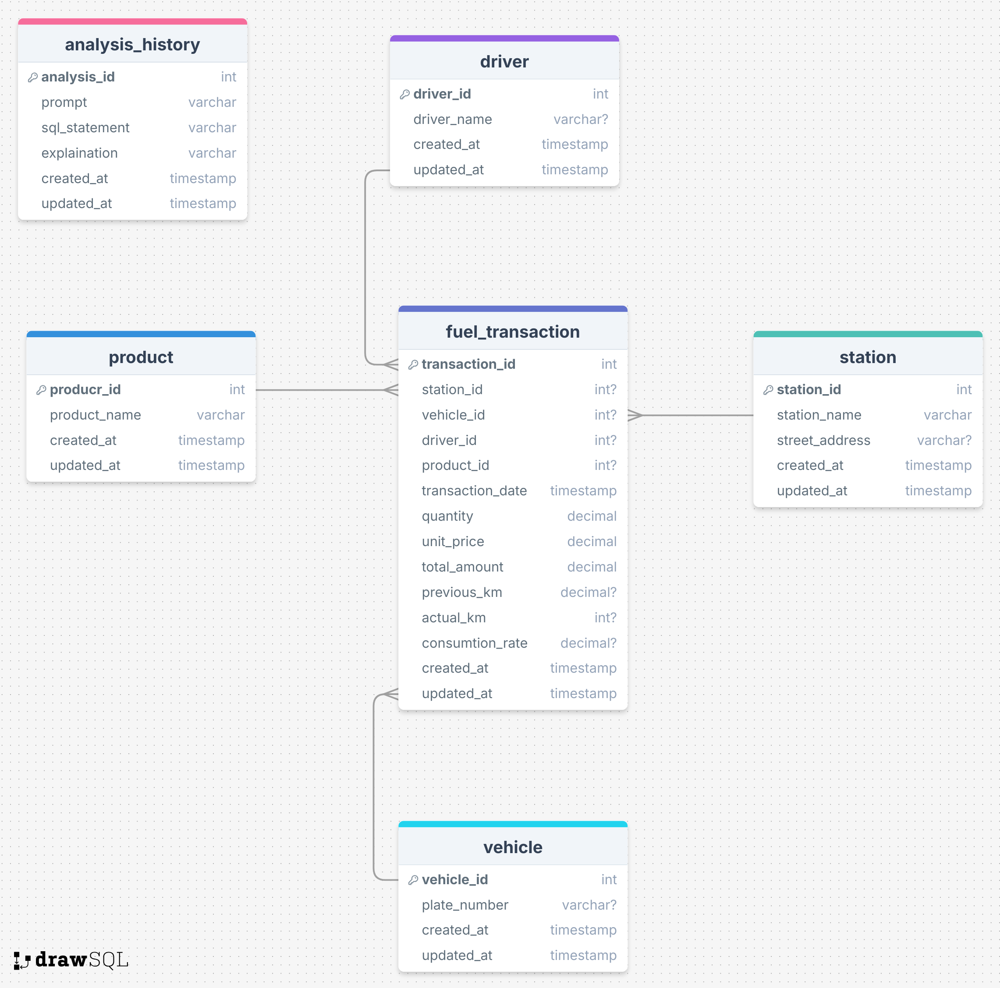

# Receipt Data Analysis System - Project Architecture

## Overview

This project implements a receipt data analysis system using FastAPI, focusing on processing and analyzing fuel transaction data, integrating with a PostgreSQL database, and generating reports. It follows a modified MVC architecture optimized for API development, where the "View" layer is replaced by "Routes" that return JSON responses for API endpoints. 

## I. Directory Structure
```
📦 app
 ├── 📂 agents
 │ ├── 📜 model.py # Base AI agent model
 │ ├── 📜 prompt_templates.py # AI prompt management
 │ ├── 📜 sql_agent.py # Database interaction agent
 │ └── 📂 schemas
 │     ├── 📜 fuel_transaction.py # Fuel transaction schemas
 │     ├── 📜 html_text.py # HTML content schemas
 │     └── 📜 sql_query.py # SQL query schemas
 ├── 📂 tools
 │ └── 📜 file_ops.py # File operation utilities for agent
 ├── 📂 models
 │ ├── 📜 analysis_history.py # Analysis history model
 │ ├── 📜 base_model.py # Base model class
 │ ├── 📜 driver.py # Driver information model
 │ ├── 📜 fuel_transaction.py # Fuel transaction model
 │ ├── 📜 product.py # Product catalog model
 │ ├── 📜 station.py # Station information model
 │ └── 📜 vehicle.py # Vehicle information model
 ├── 📂 controller
 │ └── 📜 analysis_controller.py # Analysis logic handler
 ├── 📂 routers
 │ └── 📜 api.py # API route definitions
 ├── 📂 command
 │ └── 📜 report_scheduler.py # Scheduled report generator
 ├── 📂 utils
 │ ├── 📜 db_ops.py # Database operations
 │ ├── 📜 telegram_group_loader.py # Telegram group config
 │ └── 📜 telegram_bot.py # Telegram bot integration
 ├── 📂 logs
 │ └── 📜 api.log # API request/response logs
 ├── 📂 public
 │ ├── 📂 reports
 │ │   └── 📜 html_generated_file.html # Generated report files
 │ └── 📂 uploads
 │     ├── 📂 images # Uploaded image storage
 │     ├── 📂 logs
 │     │   ├── 📜 image_logs.txt # Image processing logs
 │     │   └── 📜 text_logs.txt # Text processing logs
 │     └── 📂 prompts
 │         └── 📜 prompt.yml # AI prompt configurations
 ├── 📂 middlewares
 │ └── 📜 api_logger.py # API logging middleware
 ├── 📂 configs
 │ ├── 📜 telegram_group.yaml # Telegram configurations
 │ └── 📜 cors.py # CORS settings
 📜 .env # Environment variables
 📜 fastapi.dockerfile # FastAPI container configuration
 📜 docker-compose.yaml # Container orchestration
 📜 requirements.txt # Project dependencies
 📜 application_manager.py # Application lifecycle manager
 📜 main.py # Application entry point

 ```

 ## II. Database Structure

 

