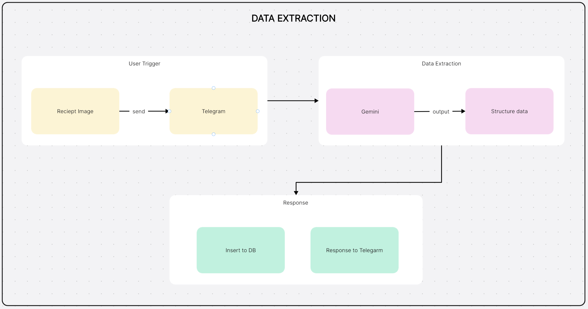
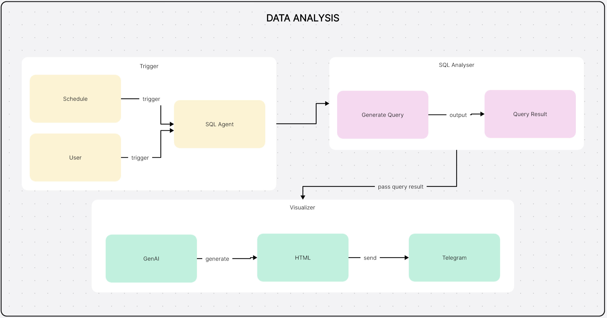
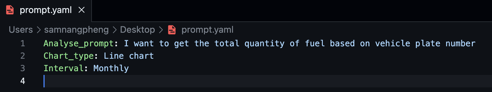

**Receipt Data Analysis System Features**
=====================================

## 1. Data Extraction

*   Automatically collect receipt images from Telegram groups when user uploaded
*   Process images using multimodal state-of-the-art model to extract receipt fields
*   Structure output using predefined Pydantic schema
*   Insert extracted data into SQL database with duplicate checking
*   Log detailed user information:
    *   Username
    *   Chat ID
    *   User ID
    *   Image name
    *   Full name

## 2. Data Analysis

*   Generate SQL statements using GenAI
*   Execute SQL queries and create HTML visualization charts
*   Send visualizations to admin Telegram group with data explanations
*   Store analysis history in SQL database
*   Log detailed user information:
    *   Username
    *   Chat ID
    *   User ID
    *   Text chat
    *   Full name

## 3. Scheduling

*   Enable users to schedule automated weekly/monthly reports
*   Allow customization of visualization types and analysis prompts
*   Support user-defined scheduling via prompt.yml file
*   Process personal prompt.yml files sent via Telegram bot
*   Store new schedule configurations on server
